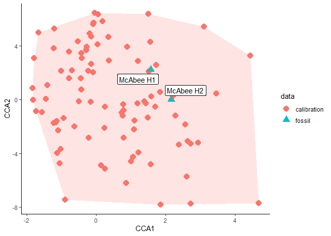

<!-- README.md is generated from README.Rmd. Please edit that file -->

# dilp

<!-- badges: start -->
<!-- badges: end -->

The goal of dilp is to help with analysis of quantitative fossil leaf
traits. Methods included are:

- Digital Leaf Physiognomy - dilp()

  - Estimate mean annual temperature and mean annual precipitation using
    multiple linear regressions.

- Fossil Leaf Mass per Area - lma()

  - Reconstruct leaf mass per area using leaf area and petiole width

- Leaf Margin Analysis - temp_slr()

  - Estimate mean annual temperature using leaf margin

- Leaf Area Analysis - precip_slr()

  - Estimate mean annual precipitation using leaf area

## Installation

You can install the development version of dilp from
[GitHub](https://github.com/) with:

``` r
# install.packages("devtools")
devtools::install_github("mjbutrim/dilp")
```

## Example

This is a basic example which shows you how to run a basic DiLP and LMA
analysis:

``` r
library(dilp)
## basic example code
dilp_results <- dilp(McAbeeExample)
lma_results <- lma(McAbeeExample)
data.frame(Site = c("McAbee H1", "McAbee H2"), 
           MAT_MLR = dilp_results$results$MAT.MLR, 
           MAT_SLR = dilp_results$results$MAT.SLR, 
           MAP_MLR = dilp_results$results$MAP.MLR, 
           MAP_SLR = dilp_results$results$MAP.SLR,
           site_mean_LMA = lma_results$lowe_site_mean_lma$value)
#>        Site  MAT_MLR  MAT_SLR MAP_MLR  MAP_SLR site_mean_LMA
#> 1 McAbee H1 13.59866 11.18065 107.076 126.7697      73.68178
#> 2 McAbee H2 11.63970  9.36000 133.633 135.8734      67.58568
```

You can check the validity of your DiLP results like so:

``` r
dilp_results$errors
#>                                                   Check Specimen1
#> 1                             Entire tooth count not NA      none
#> 2                        Entire tooth count : IP not NA      none
#> 3                         Entire perimeter ratio not NA      none
#> 4                                   FDR not between 0-1      none
#> 5 External perimeter not larger than internal perimeter      none
#> 6                Feret is not larger than minimum Feret      none
#> 7                    Perimeter ratio not greater than 1      none
```

``` r
dilp_results$outliers
#>          Variable     Outlier1     Outlier2     Outlier3    Outlier4
#> 1             fdr         <NA>         <NA>         <NA>        <NA>
#> 2           tc_ip  BU-712-1117 BU-712-1169A BU-712-1176A        <NA>
#> 3       leaf_area BU-712-2173A BU-712-2105A  BU-712-2124        <NA>
#> 4 perimeter_ratio   M-2015-1-1 BU-712-1073A  BU-712-1165 M-2015-1-62
```

``` r
dilp_cca(dilp_results)
```


