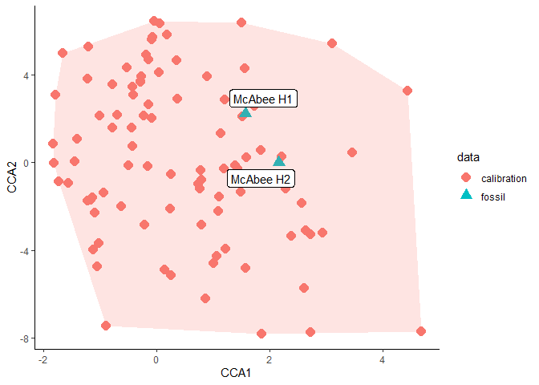

<!-- README.md is generated from README.Rmd. Please edit that file -->

# dilp

<!-- badges: start -->
<!-- badges: end -->

The goal of dilp is to help with analysis of quantitative fossil leaf
traits. Methods included are:

- Digital Leaf Physiognomy (DiLP)

  - Reconstruct mean annual temperature and mean annual precipitation

- Leaf Mass per Area via the petiole metric (LMA)

## Installation

You can install the development version of dilp from
[GitHub](https://github.com/) with:

``` r
# install.packages("devtools")
devtools::install_github("mjbutrim/dilp")
```

## Example

This is a basic example which shows you how to run a basic DiLP and LMA
analysis:

``` r
library(dilp)
## basic example code
dilp_results <- dilp(McAbeeExample)
lma_results <- lma(McAbeeExample)
dilp_results$results
#>        Site   Margin       FDR    TC.IP Ln.leaf.area  Ln.TC.IP     Ln.PR
#> 1 McAbee H1 32.25806 0.6965086 2.541611     6.792833 0.5991961 0.2027609
#> 2 McAbee H2 23.33333 0.7012671 2.651242     7.037892 0.6218561 0.1504205
#>    MAT.MLR params.MAT.MLR.error  MAT.SLR params.MAT.SLR.error MAP.MLR
#> 1 13.59866                    4 11.18065                  4.9 107.076
#> 2 11.63970                    4  9.36000                  4.9 133.633
#>   MAP.MLR.error.plus MAP.MLR.error.minus  MAP.SLR MAP.SLR.error.plus
#> 1           88.02917            48.31143 126.7697           106.5412
#> 2          109.86219            60.29365 135.8734           114.1923
#>   MAP.SLR.error.minus
#> 1            57.88926
#> 2            62.04646
```

You can check the validity of your DiLP results like so:

``` r
dilp_results$errors
#>                                                   Check Specimen1
#> 1                             Entire tooth count not NA      none
#> 2                        Entire tooth count : IP not NA      none
#> 3                         Entire perimeter ratio not NA      none
#> 4                                   FDR not between 0-1      none
#> 5 External perimeter not larger than internal perimeter      none
#> 6                Feret is not larger than minimum Feret      none
#> 7                    Perimeter ratio not greater than 1      none
```

``` r
dilp_results$outliers
#>          Variable     Outlier1     Outlier2     Outlier3    Outlier4
#> 1             FDR         <NA>         <NA>         <NA>        <NA>
#> 2           TC IP  BU-712-1117 BU-712-1169A BU-712-1176A        <NA>
#> 3       Leaf area BU-712-2173A BU-712-2105A  BU-712-2124        <NA>
#> 4 Perimeter ratio   M-2015-1-1 BU-712-1073A  BU-712-1165 M-2015-1-62
```



Yay
